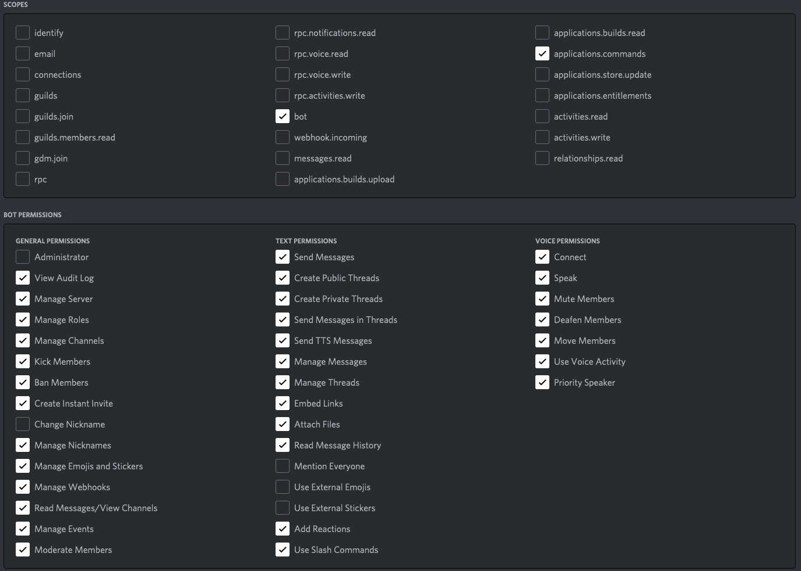
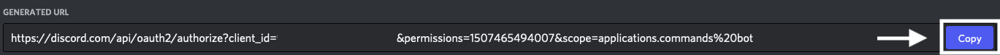
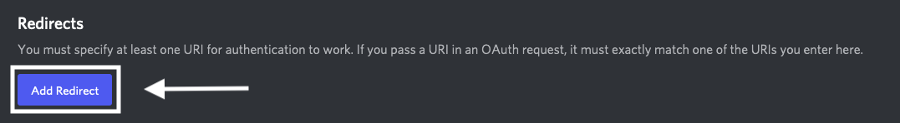
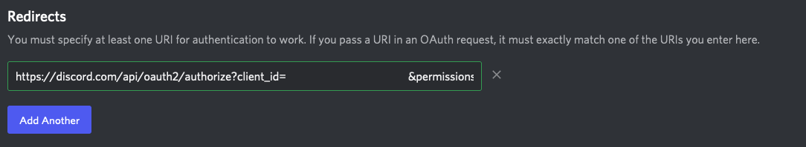
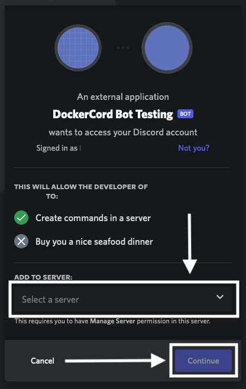
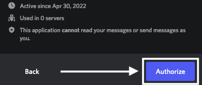
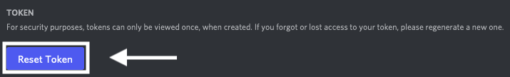
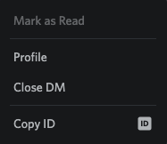
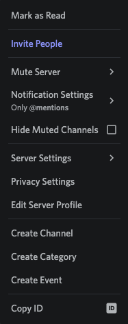

You need to supply your own
1. Discord Bot Token (found at [Discord Developer Portal](https://discord.com/developers/))
2. Client ID (found once you create a Discord Application)
3. Guild ID (found when you enable Developer Mode in Discord Settings in the Main Client
then copy your server, which is also known as a guild ID)

Other than that, this Dockerfile is usable OOTB (out of the box).

- [Railway Template](https://railway.app/new/template/Vb8UZp?referralCode=BatemaDevelopment)
- [Docker Hub](https://hub.docker.com/r/lukasbatema/dockercord-bot)
- [GHCR (GitHub Container Registry)](https://github.com/users/Lukas-Batema/packages/container/package/dockercord-bot)

# How to Create a Discord Bot, Add it To Your Server, and Get it Running

To create the bot, you will want to go to the [Discord Developer Portal](https://discord.com/developers/). To create an application, which we want to do, click, `New Application`.

Now, once we have it created, we will want to create the bot. We do this by heading over to the `Bot` tab (found on the left sidebar of the site) and clicking `Add Bot`.

Now we will add the permissions we need. Head on over to `OAuth2 -> URL Generator`. The below picture will tell you what permissions we will need.

Be sure to copy the link!

Next, we will head over to `OAuth2 -> General`. Click `Add Redirect`. Paste the link copied earlier into the box. Then paste it into your search bar in a browser and hit return.

Now we want to add our bot to the server of choice. Follow the next images to do so.

Now, we want to reset the bot token. Head on over to `Bot`. Click `Reset Token`.

Copy it, and paste it into the Enviornment Variable spot for your hosting provider. Then, copy the Bot ID by right-clicking on its profile and clicking `Copy ID`, do so with the server you added it into as well and pasting those into the respective Enviornment Variable spots.

Now you can use [Railway](https://railway.app?referralCode=BatemaDevelopment) to sign up for the best Cloud Hosting Service, so you can deploy your Discord Bot 24/7 (until you run out of your $5.00 (USD) credits for the month). CONGRATS! You just deployed your Discord Bot! I hope you enjoy it!
